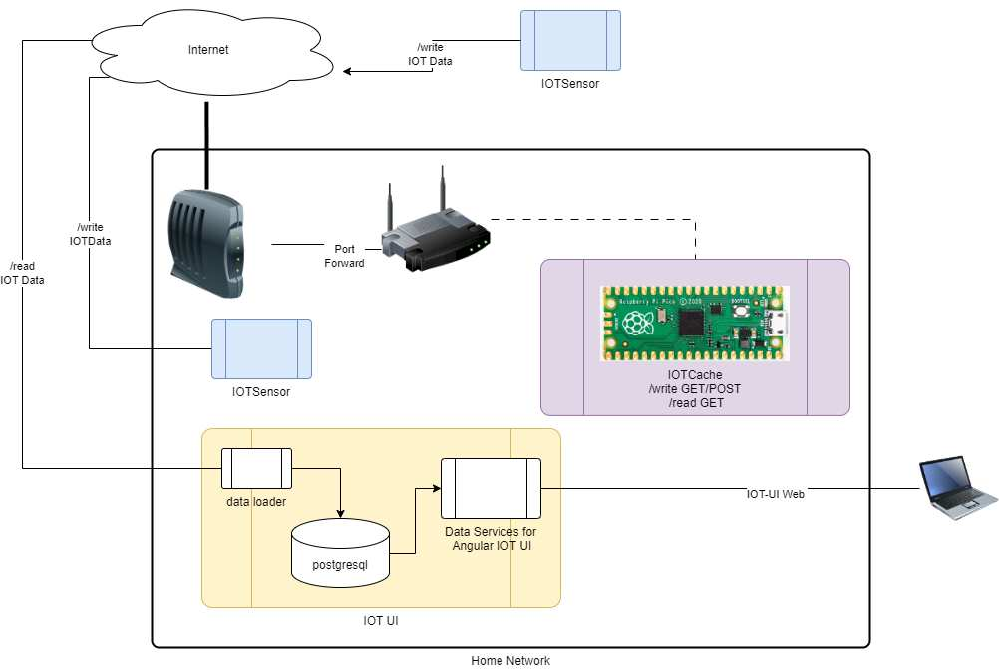

## IOTCache

### Overview

Simple IOT transaction store for use on a home network. Only one port needs to be exposed via a firewall rule. For simplicity and to reducing functional complexity I run this on a dedicated microcontroler, hopefully, this makes hacking via the exposed port more difficult and reduces possible exposure to unknown code running on the device. IOTCache stores IOT transactions submitted using HTTP post (with json) or get (With query). Transaction can be retrieved using a simple HTTP read request for use in upstream applications.

IOTCache is part of my IOT suite for my home network that includes IOTCache, IOTSensor and IOT UI (Python data loader and web services and a postgresql DB)



### Installation (see youtube video)

1. Install micropython on a Raspberry Pi Pico
2. Load the python files from this project on to the pico (use a boot.py file to automatically start the application)
3. Create a settings.json file with settings for SSID,PASSWORD,PORT,NTP
4. Open a router port to the internet for your selected PORT, forward this port to the IOTCache device.
5. Create the settings.json file with your settings

```
{"SSID": "mySSID","PASSWORD": "myPassword","NTP": "time.nist.gov","PORT": 80,"USERS": ["david","jim"]}
```

### Testing

**html**

http://[Host]:[Port]/write?iotData={"appID",4,"deviceID",1,"temperature",23.4,"user":"david"}
http://[Host]:[Port]/read?user=david

**curl**

curl command to test an iot POST transaction. \_Note need to pipe the post request to get curl to correctly recognize the quoted strings or use three double quotes

post
echo {"appID",4,"deviceID",1,"temperature",23.4,"user":"david"} | curl -v -X POST -H "Content-Type: application/json" -d @- http://[Host]:[Port]/write

get
curl -v -L -G -d iotData={"""appID""",4,"""deviceID""",1,"""temperature""",23.4,"""user""":"""david"""} http://[Host]:[Port]/write
